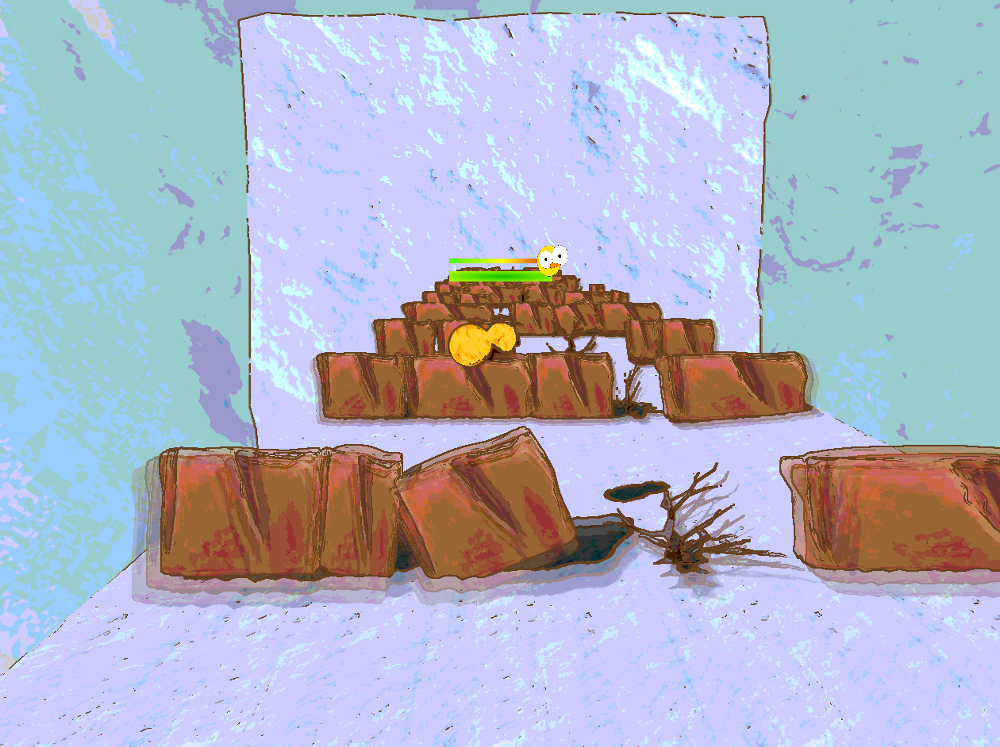
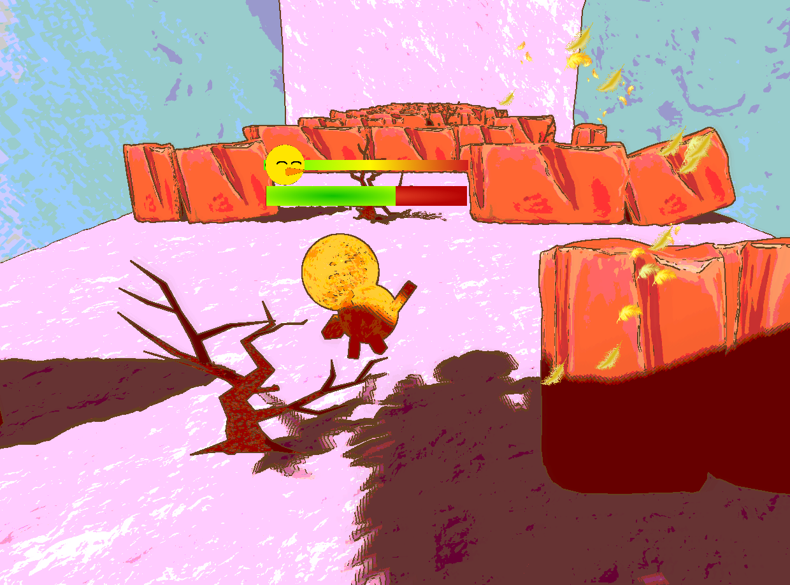
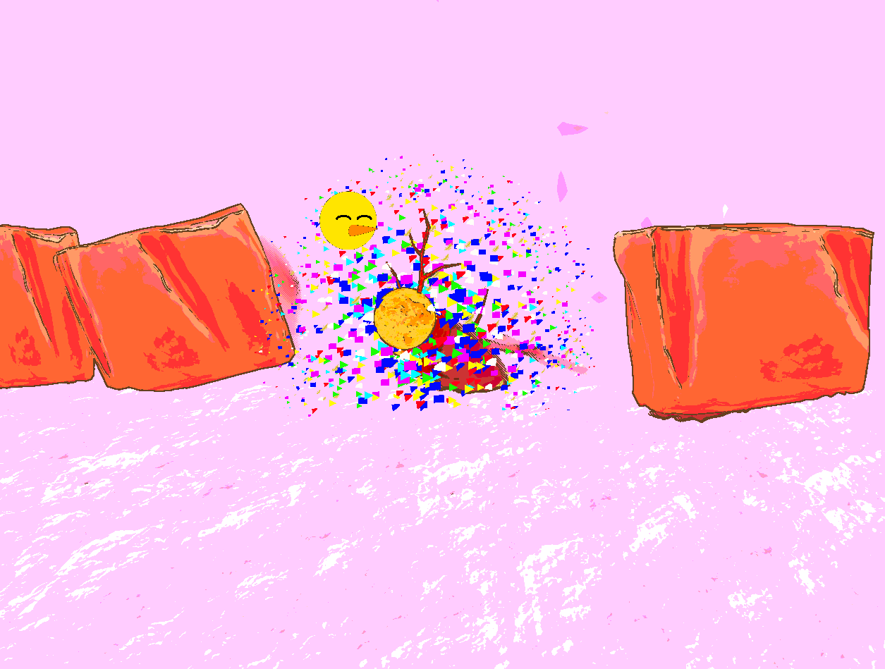

# Feather Fall Game

Help guide the chick as it falls down the cliff. Go too fast and the chick is harmed on impact with the ground. Go too slow and the eagle catches up to its delicious dinner. Bump into the rocks and branches to keep control of the speed. (Go for the branches, they won't hurt as much.) And get the chick safely to the ground.

## Game Description

### Inspiration

Arctic Geese Chicks Jump Off Cliff to Survive | Hostile Planet ([Youtube](https://www.youtube.com/watch?v=H1S6UCX4RAA))

### Controls

- **WASD:** Movement
- **M:** Toggle sound
- **RETURN:** Restart level
- **SPACE:** Start game

## Game Play

## Technologies

### Camera

The game camera is set in third-person and follows the player using "tweening" to adjust the time of the transition to the target position behind the player.

### Collision Detection

Feather Fall uses PhysX to handle collisions. Each entity in the game has a corresponding collider that is managed by the physics engine.

### Deferred Rendering

A deferred rendering system is a technique used to separate the scene’s geometry from post-processing effects such as lighting and motion blur. In Feather Fall, all of the objects’ geometry is rendered into a buffer, and information from that buffer is then passed through lighting, motion blur, and a final post-processing shader.

### Heads-up display (HUD)

The speed and health of the chick are indicated by a HUD. This was developed by rendering a quad on the screen and managed using a HUD system that keeps track of all of the elements and updates them as needed.

### Motion Blur

Feather Fall uses motion blur to give a bit more flavor to falling and to indicate speed better. It works by storing the two previous frames and blending those together with the current frame. It also only activates at a certain speed threshold.

*Motion Blur*

### NPR Rendering

The art-style of Feather Fall comes from its contouring and binning. The binning rounds all colors to certain thresholds to give it a more cartoony look. The contouring uses Sobel edge detection to determine where the edges are and then colors those edges brown to give everything a clean outline.

### Particle System

The particle system handles several particle effects throughout the game. Particles are rendered as quads with images with a specific lifespan and randomization for variation in the particles.

*Feather Particles*

### Procedural Generation

Feather Fall uses procedural generation to create a random map for the player to traverse down. The procedural generation works by choosing from a set of 5 differently scaled rocks on each level and removing one of them, and then on each subsequent row of rocks, another of the 5 rocks is taken out, only within 1 unit left and right of the missing rock in the previous row. This way there is a defined path all the way down.

### Ragdoll

The main character in Feather Fall is a ragdoll goose chick which was implemented using the Physx Articulation System. The head and limbs were connected to the torso using spherical joints which allowed the head and limbs to move freely around a point while still being connected to the torso.

### Shadows

Feather Fall uses shadow mapping to render shadows from the perspective of the single light source.

### View Frustum Culling

Feather Fall originally went with standard view frustum culling, based on the camera angle, but we found that since our camera only travels vertically facing the same direction always, we decided to use a more computationally efficient method of culling based on simple calculations regarding height. Cull if an object is behind the camera of its own radius, or below the camera based on a certain radius, provided by the entity being culled.

## Development Timeline

### Game Proposal

### 25% Milestone

### 50% Milestone

### 100% Milestone

### Losing State: Captured by eagle!

### Winning State

## Resources

- [PhysX | Physx Articulation](https://gameworksdocs.nvidia.com/PhysX/4.0/documentation/PhysXGuide/Manual/Articulations.html)
- [Irrklang | src](https://www.ambiera.com/irrklang/)
- [Edge Detection](https://observablehq.com/@ondras/glsl-edge-detection)

## Contributions

Chanelle @chmosquera: Deferred rendering, Heads-up display, Particle system
Joey @jjohn163 : Collision detection, Shadows
Kevin @KevinKrein : Non-photorealistic rendering, Procedural generation, View frustum culling
Rafael Dolfe: Camera, Motion Blur

## Acknowledgments

This project was created for the Real-time Rendering course at California Polytechnic State University, San Luis Obispo.

Gratitude goes out to my professor, my peers, and the computer graphics community for the wealth of knowledge and resources.
